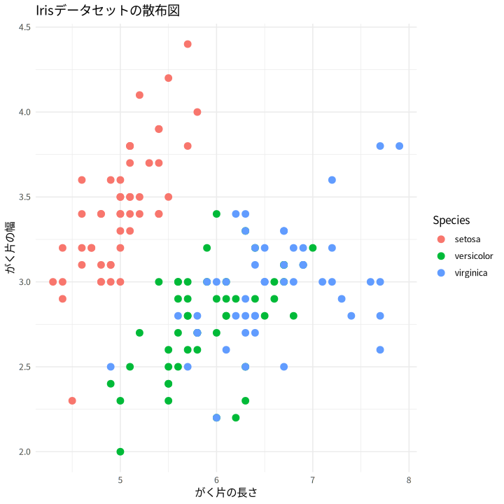
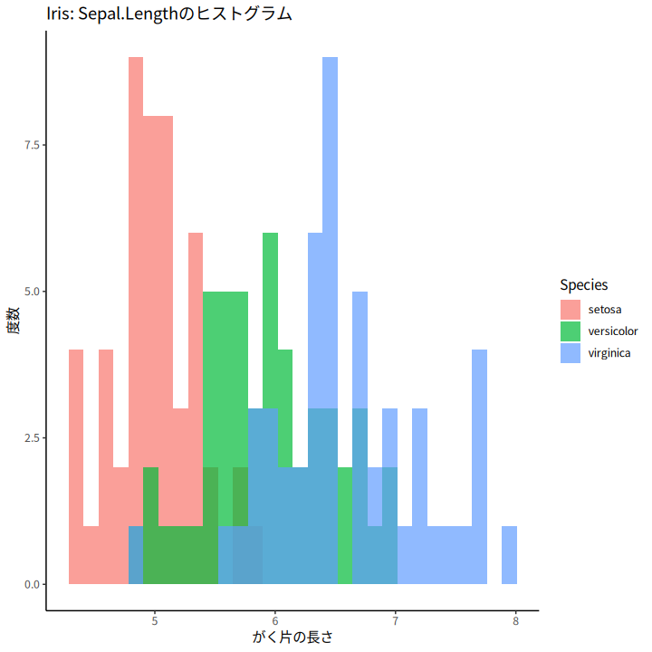
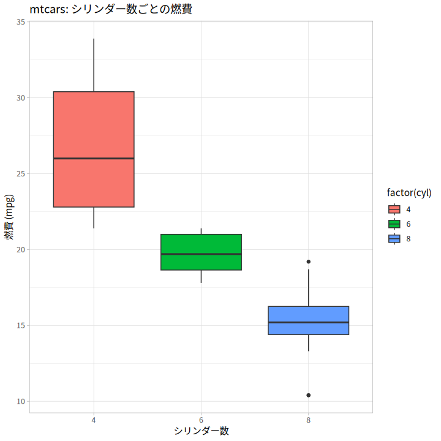
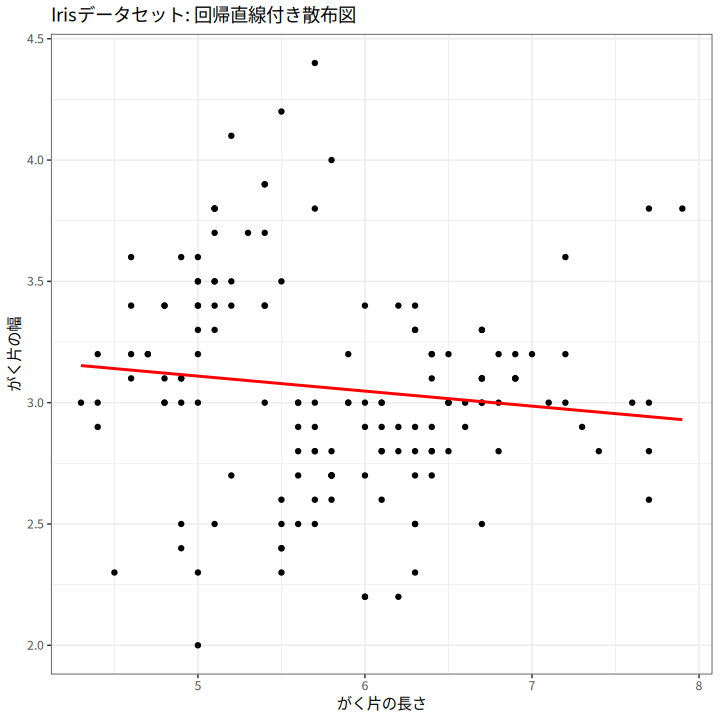
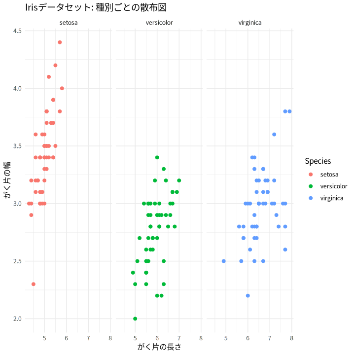

# ggplot2で作る魅力的なグラフ

このガイドでは、Rの**ggplot2**パッケージを用いて、シンプルかつ柔軟にグラフを作成する方法を紹介します。基本的な使い方から、グラフのカスタマイズ、複数の具体例を通して実際に使えるコードを掲載しています。なお、ここではdplyrの基本的なコマンド（パイプ(|>)、select、filterなど）は既にご存知であるものとして解説します。

---

## 1. ggplot2の基本構造

ggplot2では、まずデータフレームを指定し、`aes()`関数で美的属性（x軸、y軸、色、サイズなど）を設定します。その後、`geom_`系列の関数で具体的なグラフの種類を指定します。

基本構造は以下の通りです。

```r
library(ggplot2)

ggplot(data = データ, aes(x = x軸, y = y軸)) +
  geom_○○()

```
---

## 2. 具体例

### 2.1 散布図の作成

irisデータセットを用い、`Sepal.Length`と`Sepal.Width`の散布図を作成。種別（Species）ごとに色分けして表示します。

```r
library(dplyr)
library(ggplot2)

iris |> 
  ggplot(aes(x = Sepal.Length, y = Sepal.Width, color = Species)) +
  geom_point(size = 3) +
  labs(title = "Irisデータセットの散布図",
       x = "がく片の長さ",
       y = "がく片の幅") +
  theme_minimal()
```



---

### 2.2 ヒストグラムの作成

irisデータセットの`Sepal.Length`の分布をヒストグラムで表示し、Speciesごとに色分けします。

```r
iris |> 
  ggplot(aes(x = Sepal.Length, fill = Species)) +
  geom_histogram(bins = 30, alpha = 0.7, position = "identity") +
  labs(title = "Iris: Sepal.Lengthのヒストグラム",
       x = "がく片の長さ",
       y = "度数") +
  theme_classic()
```



---

### 2.3 箱ひげ図の作成

mtcarsデータセットを利用し、シリンダー数（cyl）ごとに燃費（mpg）の箱ひげ図を作成します。

```r
mtcars |> 
  ggplot(aes(x = factor(cyl), y = mpg, fill = factor(cyl))) +
  geom_boxplot() +
  labs(title = "mtcars: シリンダー数ごとの燃費",
       x = "シリンダー数",
       y = "燃費 (mpg)") +
  theme_light()
```



---

### 2.4 線グラフと回帰直線

散布図に回帰直線を追加し、データの傾向を視覚化します。

```r
iris |> 
  ggplot(aes(x = Sepal.Length, y = Sepal.Width)) +
  geom_point() +
  geom_smooth(method = "lm", se = FALSE, color = "red") +
  labs(title = "Irisデータセット: 回帰直線付き散布図",
       x = "がく片の長さ",
       y = "がく片の幅") +
  theme_bw()
```



---

### 2.5 Facetによるパネル分割

`facet_wrap`を使用して、Speciesごとにパネルを分割して表示します。

```r
iris |> 
  ggplot(aes(x = Sepal.Length, y = Sepal.Width, color = Species)) +
  geom_point(size = 2) +
  facet_wrap(~ Species) +
  labs(title = "Irisデータセット: 種別ごとの散布図",
       x = "がく片の長さ",
       y = "がく片の幅") +
  theme_minimal()
```



---

## 3. グラフのカスタマイズ

### 3.1 テーマの変更

ggplot2には、グラフの見た目を変えるためのテーマが複数用意されています。例えば、`theme_minimal()` や `theme_classic()` を使ってシンプルなデザインに変更できます。

```r
ggplot(iris, aes(x = Sepal.Length, y = Sepal.Width)) +
  geom_point() +
  theme_minimal() +
  labs(title = "Minimalテーマの散布図")
```

### 3.2 ラベルやタイトルの追加

`labs()` 関数を使って、タイトルや軸ラベルを設定できます。

```r
ggplot(iris, aes(x = Sepal.Length, y = Sepal.Width)) +
  geom_point() +
  labs(title = "散布図タイトル",
       x = "がく片の長さ",
       y = "がく片の幅")
```

### 3.3 その他のカスタマイズ

- **色やサイズ、透明度の調整**：各`geom`関数内で引数を指定することで簡単に変更可能です。
- **スケールの調整**：`scale_x_continuous()` や `scale_color_manual()` などを使用して、軸の目盛りやカラーパレットを調整できます。

---

## 4. まとめ

ggplot2は、シンプルなコードで高度なグラフ作成が可能な非常にパワフルなツールです。ここで紹介した基本例をもとに、データに合わせたカスタマイズや複雑なグラフの作成に挑戦してみてください。各種テーマやラベルの調整を駆使して、自分のデータを魅力的に可視化しましょう！

---

# 演習問題

以下の7問の演習問題に挑戦してみましょう。各問題の答えは、トグルで表示されるようになっています。

1. **基本的な散布図**  
   irisデータセットを使用して、`Sepal.Length`と`Sepal.Width`の散布図を作成するコードを書いてください。

<details>
<summary>答えを見る</summary>

```r
library(ggplot2)
iris |> 
  ggplot(aes(x = Sepal.Length, y = Sepal.Width)) +
  geom_point() +
  labs(title = "基本散布図", x = "がく片の長さ", y = "がく片の幅")
```
</details>

2. **ヒストグラム**  
   irisデータセットで、`Sepal.Length`のヒストグラムを作成し、Speciesで色分けするコードを書いてください。

<details>
<summary>答えを見る</summary>

```r
library(ggplot2)
iris |> 
  ggplot(aes(x = Sepal.Length, fill = Species)) +
  geom_histogram(bins = 30, alpha = 0.6, position = "identity") +
  labs(title = "ヒストグラム", x = "がく片の長さ", y = "度数")
```
</details>

3. **箱ひげ図**  
   mtcarsデータセットを使用して、`cyl`（シリンダー数）ごとに`mpg`の箱ひげ図を作成するコードを書いてください。

<details>
<summary>答えを見る</summary>

```r
library(ggplot2)
mtcars |> 
  ggplot(aes(x = factor(cyl), y = mpg, fill = factor(cyl))) +
  geom_boxplot() +
  labs(title = "箱ひげ図", x = "シリンダー数", y = "燃費 (mpg)")
```
</details>

4. **回帰直線の追加**  
   散布図に回帰直線を追加するコードを書いてください。

<details>
<summary>答えを見る</summary>

```r
library(ggplot2)
iris |> 
  ggplot(aes(x = Sepal.Length, y = Sepal.Width)) +
  geom_point() +
  geom_smooth(method = "lm", se = FALSE, color = "red") +
  labs(title = "回帰直線付き散布図", x = "がく片の長さ", y = "がく片の幅")
```
</details>

5. **Facetプロット**  
   irisデータセットを種別ごとに分割した散布図を作成するコードを書いてください。

<details>
<summary>答えを見る</summary>

```r
library(ggplot2)
iris |> 
  ggplot(aes(x = Sepal.Length, y = Sepal.Width, color = Species)) +
  geom_point() +
  facet_wrap(~ Species) +
  labs(title = "Facetプロット", x = "がく片の長さ", y = "がく片の幅")
```
</details>

6. **テーマの変更**  
   `theme_minimal()` を使用してグラフのテーマを変更するコードを書いてください。

<details>
<summary>答えを見る</summary>

```r
library(ggplot2)
iris |> 
  ggplot(aes(x = Sepal.Length, y = Sepal.Width)) +
  geom_point() +
  theme_minimal() +
  labs(title = "Minimalテーマの散布図")
```
</details>

7. **ラベルの追加**  
   グラフにタイトル、x軸、y軸のラベルを追加するコードを書いてください。

<details>
<summary>答えを見る</summary>

```r
library(ggplot2)
iris |> 
  ggplot(aes(x = Sepal.Length, y = Sepal.Width)) +
  geom_point() +
  labs(title = "散布図タイトル", x = "がく片の長さ", y = "がく片の幅")
```
</details>
```

---

